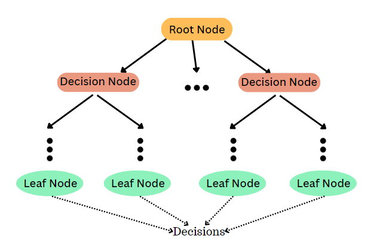
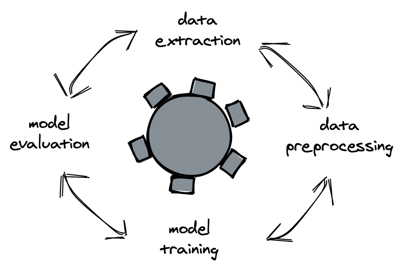

# Decision Tree Classification problem using Iris Dataset

Implementation of a decision Tree classifier for the [iris datatset](https://www.kaggle.com/datasets/uciml/iris)


## Why Decision Tree(DT)?

Decision trees being a type of supervised learning algorithm, they're useful for classification and regression tasks. They work by recursively partitioning the feature space into regions, with each region corresponding to a specific class label.



## The Objective

The Iris dataset contains four features (sepal length, sepal width, petal length, and petal width) of three different species of iris flowers. The challenge is to predict the species of iris flowers based on these features.


For more info about iris dataset visit => [Kaggle](https://www.kaggle.com/datasets/uciml/iris)

## What's expected to be shown


- Familiarity with importing datasets and essential Python libraries.
- Proficiency in exploring and understanding datasets.
- Capacity to construct and train a Decision Tree.
- Ability to assess the accuracy of the model.
- Skill in visualizing the decision tree.

## Methodology



1. Data Exploration - The dataset is loaded into a pandas DataFrame and explored to understand its structure and characteristics.

```python
# Load the dataset into a pandas DataFrame
import pandas as pd
df = pd.DataFrame(iris.data, columns=iris.feature_names)

# Display a summary of the dataset
print("Summary of the Iris Dataset:")
print(df.describe())

# Display the first few rows of the dataset
print("\nFirst few rows of the Iris Dataset:")
print(df.head())
```

2. Data Visualization - The seaborn library is used to create pair plots to visualize the relationships between the features andthe target variable.

```python
# Visualize the dataset using pair plots
import seaborn as sns
sns.pairplot(df, hue='target')
```

3. Data Preprocessing - The dataset is split into training and testing sets using the train_test_split function from the sklearnlibrary.

```python
# Split the dataset into training and testing sets
from sklearn.model_selection import train_test_split
X_train, X_test, y_train, y_test = train_test_split(iris.data, iris.target, test_size=0.2, random_state=42)
```

4. Model Training - A Decision Tree classifier is built and trained using the training data.

```python
# Build and train the Decision Tree
from sklearn.tree import DecisionTreeClassifier
clf = DecisionTreeClassifier(random_state=42)
clf.fit(X_train, y_train)
```

5. Model Evaluation - The accuracy of the model is evaluated using the testing data.

```python
# Predict the target values for the test set
y_pred = clf.predict(X_test)

# Calculate the accuracy of the model
from sklearn.metrics import accuracy_score
accuracy = accuracy_score(y_test, y_pred)
print(f"Accuracy: {accuracy*100:.2f}%")
```

6. Model Visualization - The trained Decision Tree is visualized using the plot_tree function from the sklearn library.

```python
# Visualize the Decision Tree
import matplotlib.pyplot as plt
plt.figure(figsize=(15,10))
from sklearn.tree import plot_tree
plot_tree(clf, feature_names=iris.feature_names, class_names=iris.target_names, filled=True)
plt.show()
```

---


Fig. DT Visualized

---
